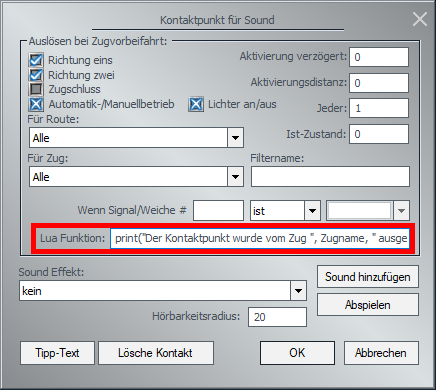

# BetterContacts

`BetterContacts` macht Kontaktpunkte besser: In das Eingabefeld für Lua-Aufrufe können nun auch Funktionsparameter eingegeben werden.
`BetterContacts` ist der Nachfolger meiner berühmten „Codezeile“, die die selbe Funktion hatte. Die Auslagerung in ein separates Modul macht den Code übersichtlicher und fasst mehrere Varianten der ursprünglichen Codezeile zusammen.

### Schnellstartanleitung

#### 1. Installieren

Nach dem [Download](http://emaps-eep.de/lua/bettercontacts) die zip-Datei in EEP über den Menüpunkt „Modelle installieren“ installieren (gibt es erst ab EEP13), ansonsten die zip-Datei entpacken und die `Installation.eep` aufrufen, oder die `BetterContacts_BH2.lua` von Hand ins EEP-Verzeichnis in den Unterordner `LUA` kopieren.

#### 2. Einbinden

Füge diese Zeile an den Anfang des Anlagen-Skripts ein:

```lua
require("BetterContacts_BH2")
```

##### 2.1. Vorzeitigen Lua-Stopp verhindern

Stelle sicher, dass die Funktion `EEPMain` niemals mittels `return 0` beendet wird (sondern immer mit `return 1`).
Leider enthält das Standardskript ab EEP16 ein `return 0`. Falls noch nicht geschehen, entferne die folgende Zeile:

```lua
    if (I>9) then return 0 end
```

_Falls du das vergisst, wird BetterContacts eine Warnung ins Ereignisfenster schreiben_

#### 3. Aktivieren

Schalte in den 3D-Modus, sodass Lua einmal ausgeführt wird.

#### 4. Verwenden

Jetzt kannst du beliebige Lua-Befehle in die Kontaktpunkte schreiben, insbesondere auch Funktionsaufrufe mit Parametern. Der Name des aktuellen Zugs steht dabei in der Variablen `Zugname` zur Verfügung.



##### Beispiele für Kontaktpunkt-Einträge

- `print("Der Kontaktpunkt wurde vom Zug ", Zugname, " ausgelöst")`  
  &rarr; Schreibt den Namen des Zuges mittels `print` ins Ereignisfenster.
- `EEPSetSignal(3, 2, 1)`  
  &rarr; Schaltet das Signal mit der Signal-ID 3 in die zweite Stellung (und ruft die Callback-Funktion auf, sofern eine definiert ist). Zugegeben, das könnte man auch mit einem normalen Signal-Kontaktpunkt erreichen...
- `ZugAusDepot(2)`  
  &rarr; Ruft den nächsten Zug aus dem Depot 2 ab (sofern eine entsprechende `function ZugAusDepot(depotNummer)` im Skript definiert ist).
- `RegistriereZugAnSignal(Zugname, 1234)`  
  &rarr; Registriert den Zug für Signal 1234 (sofern eine entsprechende `function RegistriereZugAnSignal(zugname, signalId)` im Skript definiert ist).

Bitte beachte, dass das Eingabefeld maximal 63 Zeichen zulässt.

### Konfigurations-Möglichkeiten

Es ist möglich, einige Aspekte von BetterContacts zu konfigurieren. Dazu muss die `require`-Zeile folgendermaßen ergänzt werden:

```lua
require("BetterContacts_BH2"){printErrors=true, chunkname="Kontaktpunkt-Eintrag"}
```

Dabei werden die folgenden Parameter unterstützt:

- ⚠️ `varname`: Ein beliebiger Variablenname als String (standardmäßig `"Zugname"`). Unter diesem Variablennamen wird der von EEP übergebene Name des Zuges bereitgestellt, der den Kontaktpunkt überfahren hat. Wenn du lieber einen anderen Variablennamen verwenden willst, kannst du das mit dieser Option ändern.
- `printErrors`: `true` oder `false` (Standardwert). Wenn `true`, wird bei Syntaxfehlern eine entsprechende Meldung im Ereignisfenster ausgegeben, die beim Fehlersuchen helfen kann (siehe [unten](#Fehlersuche)).
- `chunkname`: Ein beliebiger String (standardmäßig `"KP-Eintrag"`). Dieser wird als _Chunkname_ an Lua übergeben und taucht in Fehlermeldungen auf. Die Funktionalität wird durch diesen Parameter nicht verändert.
- ⚠️ `replaceDots`: `true` oder `false` (Standardwert). Dies ist für EEP 10 nötig, da bei dieser Version fälschlicherweise alle in das Eingabefeld eingegebenen Kommas in Punkte umgewandelt werden. Wenn `replaceDots` auf `true` gesetzt ist, werden alle Punkte wieder in Kommas zurückverwandelt. Somit ist es möglich, mehrere (durch Komma getrennte) Parameter an eine Funktion zu übergeben. Leider werden damit auch gewollte Punkte durch Kommas ersetzt, sodass eine Dezimalzahl (z.B. `10.2`) als zwei Parameter `10, 2` interpretiert wird. Ab EEP 11(?) ist die fälschliche Komma-durch-Punkt-Ersetzung behoben, sodass diese Option nicht mehr benötigt wird (sofern es in der Anlage nicht noch alte Kontaktpunkte mit falschen Punkten gibt).
- `preventReturn0`: `true` (Standardwert) oder `false`. Wenn `true`, wird ein `return 0` in der EEPMain abgefangen und stattdessen `1` zurückgegeben. Dieser Eingriff wird mit einer Warnung im Ereignisfenster kommentiert.  
  Eine kurze Erklärung dazu: Wird die `EEPMain` einmal mit `return 0` beendet, wird sie anschließend von EEP nicht mehr erneut aufgerufen. Das ist das gewollte Verhalten (wobei mir kein sinnvoller Anwendungsfall dafür einfällt). Es gibt aber auch eine ungewollte Konsequenz: Wenn du nun einen Kontaktpunkt-Dialog mit „komplexem“ Lua-Eintrag (der von BetterContacts behandelt werden muss) per Klick auf OK schließen willst, hängt sich EEP komplett auf, und alle ungespeicherten Änderungen sind verloren. Die Option `preventReturn0` versucht dies zu verhindern. Wenn du dir sicher bist, dass deine `EEPMain` niemals mit `return 0` beendet wird, kannst du dieses Sicherheitsfeature auf eigene Gefahr abschalten.

**Achtung:** Die mit ⚠️ markierten Parameter `varname` und `replaceDots` können nicht nach Belieben geändert werden, sondern müssen zu den tatsächlichen Einträgen in den Kontaktpunkten auf der Anlage passen.

_Unwichtiger Hinweis:_ Bei der oben angegebenen `require`-Zeile handelt es sich um eine Kurzschreibweise, die dank verschiedener technischer Kniffe möglich ist. Die folgende Langversion (mit `.setOptions`, Klammern und Zeilenumbrüchen) macht genau das gleiche:

```lua
require("BetterContacts_BH2").setOptions({
  printErrors = true,
  chunkname = "Kontaktpunkt-Eintrag",
})
```

### Fehlersuche

Beim Programmieren kann es immer vorkommen, dass man sich mal verschreibt.
Zum Beispiel könnte es sein, dass du Folgendes in einen Kontaktpunkt eingetragen hast:  
`print("Der Kontaktpunkt wurde vom Zug ", Zugname, " ausgelöst!"`  
Wenn du jetzt auf OK klickst, beschwert sich EEP, dass es die entsprechende „Lua Funktion nicht finden“ kann. So eine Fehlermeldung ist nicht hilfreich.

Um herauszufinden, wo der Fehler liegt, kannst du bei BetterContacts die Option `printErrors` auf `true` setzen (siehe [oben](#Konfigurations-Möglichkeiten)).
Dazu musst du den Kontaktpunkt mit Abbrechen verlassen (vorher am besten den fehlerhaften Eintrag in die Zwischenablage kopieren), dann den Lua-Editor öffnen, die `require`-Zeile entsprechend anpassen, per Klick auf den entsprechenden Knopf das Skript neu laden, in den EEP-Optionen das „EEP Ereignis Fenster“ aktivieren, den Kontaktpunkt-Dialog wieder öffnen und den Code aus der Zwischenablage einfügen.  
Wenn du jetzt auf OK klickst, kommt wieder die wenig hilfreiche Fehlermeldung von EEP. Gleichzeitig erscheint im Ereignisfenster aber auch noch eine Fehlermeldung mit mehr Details:  
`[string "Kontaktpunkt-Eintrag"]:1: ')' expected near 'end'`  
Diese von Lua generierte Fehlermeldung ist zwar auch etwas kryptisch, enthält aber die wesentliche Info: Es fehlt eine schließende Klammer am Ende.

Wenn du diese Hilfe zur Fehlersuche nicht mehr benötigst, kannst du die Option `printErrors` wieder deaktivieren (entweder gar nicht angeben oder explizit auf `false`).

### Umstieg vom Codeschnipsel zu BetterContacts

Falls du bisher schon meinen [Codeschnipsel](https://emaps-eep.de/lua/code-schnipsel#kp-parameter) benutzt hast, ist der Umstieg auf BetterContacts ziemlich einfach: Lösche den Codeschnipsel aus deinem Lua-Skript und befolge dann die [Schnellstartanleitung](#Schnellstartanleitung).

Falls du bisher eine der Varianten des Codeschnipsels mit Punkt-Komma-Ersetzung verwendet hast (das erkennst du daran, dass irgendwo `gsub("%.",",")` vorkommt), musst du zusätzlich die Option `replaceDots` aktivieren. Damit sieht die `require`-Zeile folgendermaßen aus:

```lua
require("BetterContacts_BH2"){replaceDots=true}
```

**Aber Achtung!** Es gibt einen Breaking Change, also eine Änderung, die zu Fehlern in deinem Code führen kann: Im Codeschnipsel wurde `Zugname` als globale Variable gesetzt, und stand damit während des Kontaktpunkt-Aufrufs im gesamten Skript zur Verfügung. In BetterContacts ist `Zugname` eine lokale Variable, die nur direkt innerhalb des Kontaktpunkt-Eintrags zur Verfügung steht (um von dort als Funktionsparameter weitergegeben zu werden).

Der folgende Code hat bisher funktioniert und wird auch weiterhin funktionieren:

```lua
function myFunc(_zugname)
  print("Die Funktion myFunc wurde vom Zug namens ".._zugname.." aufgerufen!")
end

-- Eintrag im Kontaktpunkt:
myFunc(Zugname)
```

Dabei ist es egal, ob die lokale Variable `_zugname`, `Zugname` oder noch anders heißt.

Der folgende Code hat mit dem Codeschnipsel (leider) funktioniert, wird mit BetterContacts aber nicht mehr funktionieren:

```lua
function myFunc()
  print("Die Funktion myFunc wurde vom Zug namens "..Zugname.." aufgerufen!")
end

-- Eintrag im Kontaktpunkt:
myFunc()
```

Ich hatte nie vorgesehen, dass `Zugname` als globale Variable verwendet wird, aber leider haben es doch einige Leute gemacht. Falls du dazugehörst, ist es jetzt eine gute Gelegenheit, dein Skript (und die Einträge in den Kontaktpunkten) entsprechend umzustellen. Falls du dabei Hilfe benötigst, frage am besten im [EEP-Forum](https://www.eepforum.de/) nach.

### Technische Details

Solange du BetterContacts „nur“ verwenden willst, sind die folgenden technischen Details für dich unwichtig. Wenn du aber auch verstehen willst, _wie_ BetterContacts funktioniert, darfst du gerne weiterlesen.

#### Funktionsweise

Zuerst solltest du folgendes wissen: Alle in Lua definierten globalen Variablen und Funktionen sind „in Wirklichkeit“ nichts anderes als Einträge in der speziellen Tabelle namens `_ENV`. Statt `myVar=1` kannst du also genausogut `_ENV["myVar"]=1` schreiben. Der Funktionsaufruf `myFunc()` kann auch als `_ENV["myFunc"]()` geschrieben werden. Wenn du in EEP nun irgendetwas in das Lua-Feld eines Kontaktpunkts einträgst, schaut EEP nach, ob unter diesem Eintrag in der Tabelle `_ENV` eine Funktion gespeichert ist. Wenn ja, ist alles gut. Wenn nicht, dann meckert EEP, dass die Funktion nicht gefunden wurde.

Gibst du in die Lua-Eingabezeile im Kontaktpunktdialog beispielsweise `myFunc(1,2)` ein (weil du die Funktion `myFunc` mit den Parametern `1` und `2` aufrufen willst), sucht EEP nach dem Eintrag `_ENV["myFunc(1,2)"]`. Wohlgemerkt, die Klammern und Parameter gehören hier zum Funktionsnamen, den EEP sucht!

Genau an dieser Stelle setzt BetterContacts an. Lua erlaubt es nämlich, eine spezielle Funktion aufzurufen, sobald in einer Tabelle auf ein Element zugegriffen werden soll, das gar nicht existiert. Wenn diese spezielle Funktion einen Rückgabewert hat, wird dieser Rückgabewert als Wert des Tabellenelements verwendet.
Dazu wird beim Einbinden von BetterContacts eine sogenannte „Metatable“ für `_ENV` gesetzt, und darin eine Funktion namens `__index` definiert:

```lua
local mt = getmetatable(_ENV) or {}
setmetatable(_ENV, mt)

mt.__index = function(self, key)
  return parseKey(self, key) or queryOldIndex(self, key)
end
```

Diese Funktion wird nun immer dann von Lua aufgerufen, wenn auf eine globale Variable zugegriffen wird, die es gar nicht gibt (bzw. die den Wert `nil` hat; das ist für Lua das Gleiche). Diese Funktion ruft nun erst eine weitere Funktion namens `parseKey` auf, die sich um Variablennamen wie `"myFunc(1,2)"` kümmert (dazu später mehr). Falls `parseKey` nichts (also `nil`) zurückgibt, wird stattdessen die Hilfsfunktion `queryOldIndex` aufgerufen. Falls vorher bereits eine andere `__index`-Funktion definiert war, die durch die BetterContacts-`__index`-Funktion überschrieben wurde, wird diese frühere `__index`-Funktion jetzt durch `queryOldIndex` aufgerufen.

Die eigentliche „Magie“ geschieht in der Funktion `parseKey`, die hier etwas vereinfacht dargestellt ist:

```lua
local function parseKey(self, key)
  if not string.find(key, "[^%w_]") then return nil end
  local code = "return function(Zugname) "..key.." end"
  local parsed, message = load(code, "KP-Eintrag")
  if parsed then
    local myFunction = parsed()
    _ENV[key] = myFunction
    return myFunction
  elseif options.printErrors then
    print(message)
  end
  return nil
end
```

- Zuerst wird geprüft, ob es sich bei der angefragten Variable um einen „normalen Variablennamen“ handelt. In Lua darf ein Variablenname aus Groß- und Kleinbuchstaben, Zahlen (in einem regulären Ausdruck ist das alles als `%w` zusammengefasst) und Unterstrichen bestehen. Mit einem normalen Variablennamen kann BetterContacts nichts anfangen, deshalb wird `nil` zurückgegeben. BetterContacts wird erst aktiv, sobald im angefragten Variablennamen irgendein Sonderzeichen (z.B. eine Klammer) vorkommt.  
  Ohne diese Abfrage würden (bei aktivierter Option `printErrors`) auch dann Fehlermeldungen ins Ereignisfenster geschrieben werden, wenn im Skript „ganz normal“ auf eine globale Variable zugegriffen wird, die nicht definiert bzw. `nil` ist.
- Die angefragte Variable wird nun in einen String eingebaut. Falls du in einem Kontaktpunkt `print(Zugname)` eingetragen hast, sieht dieser String so aus (Zeilenumbrüche und Syntaxhervorhebung sind nur zur besseren Lesbarkeit):
  ```lua
  return function(Zugname)
    print(Zugname)
  end
  ```
- Dieser String wird nun an die Lua-Funktion `load` übergeben. `load` macht aus einem beliebigen String ausführbaren Code, und gibt eine Funktion zurück, die hier in der Variable `parsed` gespeichert wird. Sobald diese Funktion aufgerufen wird, wird der entsprechenden Code einmal ausgeführt. Falls der übergebene Code einen Syntaxfehler enthält, wird stattdessen `nil` zurückgegeben. Als zweiten Rückgabewert gibt es dann noch zusätzlich eine Fehlermeldung, die hier in der Variable `message` gespeichert wird.
- Falls `parsed` nicht `nil` ist (also wenn es sich um eine gültige Funktion handelt), wird die Funktion einmal ausgeführt. Diese Funktion (weil mit `return function(Zugname) ...` definiert) gibt eine neue Funktion zurück, die in der Variablen `myFunction` gespeichert wird. Diese neue Funktion erwartet einen Parameter (den Zugnamen), und führt dann den Code aus, der im Kontaktpunkt eingetragen wurde (wobei der Zugname in einer lokalen Variable zur Verfügung steht). Diese Funktion `myFunction` wird nun einerseits als globale Variable gespeichert (damit die ganze Berechnung bei erneutem Überfahren des selben Kontaktpunkts nicht nochmal wiederholt werden muss), und andererseits zurückgegeben.
- Falls es einen Syntaxfehler gab, wird die entsprechende Fehlermeldung mittels `print(message)` ins Ereignisfenster geschrieben (zumindest dann, wenn die Option `printErrors` aktiviert wurde).
- Sofern die Funktion `parseKey` nicht schon vorher mittels `return myFunction` verlassen wurde, wird abschließend explizit `nil` zurückgegeben. Das bedeutet so viel wie: „Mit diesem Variablennamen kann ich auch nichts anfangen.“

#### API

Der Aufruf von `require("BetterContacts_BH2")` gibt eine Tabelle mit den Feldern `_VERSION`, `_DESCRIPTION`, `_URL` und `_LICENSE` zurück. Außerdem enthält die Tabelle noch die zwei Funktionen `getOptions` (benötigt keine Parameter) und `setOptions` (erwartet eine Tabelle als Paramater, siehe [oben](#Konfigurations-Möglichkeiten)).
Als Kurzschreibweise kann statt `.setOptions` auch der Rückgabewert von `require("BetterContacts_BH2")` direkt aufgerufen werden (implementiert mittels `__call` in der Metatable).

### Changelog

Siehe [EMAPS](http://emaps-eep.de/lua/bettercontacts) oder [GitHub-Release-Seite](https://github.com/EEP-Benny/BetterContacts/releases).
